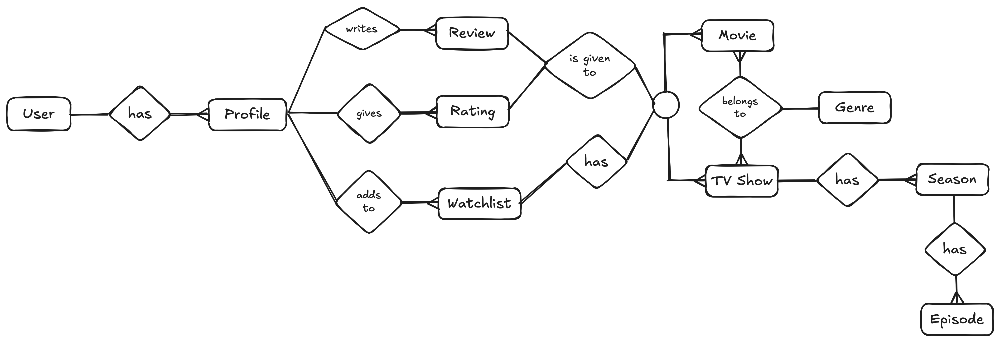

# ER Model and ER Diagram for Netflix

## Entities and Their Attributes:

### User  
- **UserID** (PK)  
- **Name**  
- **Email** (Unique)  
- **Password**  
- **SubscriptionPlan**  
- **JoinDate**  

### Profile (A single Netflix account can have multiple profiles)  
- **ProfileID** (PK)  
- **UserID** (FK)  
- **ProfileName**  
- **ProfileType** (e.g., Kid/Adult)  
- **CreatedDate**  

### Movie  
- **MovieID** (PK)  
- **Title**  
- **ReleaseYear**  
- **Duration**  
- **GenreID** (FK)  
- **RatingID** (FK)  

### TV Show  
- **ShowID** (PK)  
- **Title**  
- **GenreID** (FK)  
- **RatingID** (FK)  

### Season  
- **SeasonID** (PK)  
- **ShowID** (FK)  
- **SeasonNumber**  
- **ReleaseYear**  

### Episode  
- **EpisodeID** (PK)  
- **SeasonID** (FK)  
- **Title**  
- **EpisodeNumber**  
- **Duration**  

### Genre  
- **GenreID** (PK)  
- **GenreName**  

### Watchlist (Each profile has a unique watchlist)  
- **WatchlistID** (PK)  
- **ProfileID** (FK)  
- **MovieID** (FK) (Nullable)  
- **ShowID** (FK) (Nullable)  

### Review  
- **ReviewID** (PK)  
- **ProfileID** (FK)  
- **MovieID** (FK) (Nullable)  
- **ShowID** (FK) (Nullable)  
- **ReviewText**  
- **ReviewDate**  

### Rating  
- **RatingID** (PK)  
- **ProfileID** (FK)  
- **MovieID** (FK) (Nullable)  
- **ShowID** (FK) (Nullable)  
- **Stars** (1 to 5)  

---

## Relationships:
- A **User** can have multiple **Profiles** (**One-to-Many**).  
- A **Profile** can add multiple **Movies or TV Shows** to their **Watchlist** (**One-to-Many**).  
- A **Profile** can give multiple **Ratings** or **Reviews** to a **Movie** or **TV Show** (**One-to-Many**).  
- A **TV Show** consists of multiple **Seasons** (**One-to-Many**).  
- A **Season** consists of multiple **Episodes** (**One-to-Many**).  
- A **Movie** or **TV Show** belongs to a single **Genre**, but a **Genre** can have multiple **Movies/TV Shows** (**One-to-Many**).  
- A **Profile** can review or rate both **Movies** and **TV Shows** (**Many-to-Many**).  
